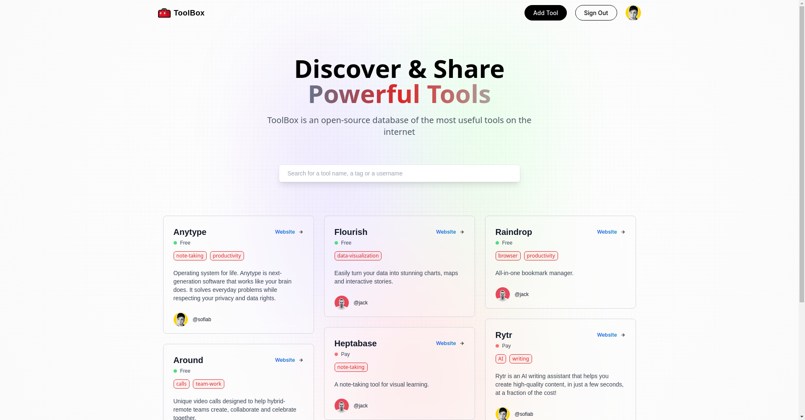

# ToolBox App

ToolBox is an open-source Next.js full-stack application designed to serve as a comprehensive database of the most useful tools available on the internet. Whether you're a developer, designer, marketer, or just someone looking for handy online resources, ToolBox is here to help you discover and share the best tools.

## Features

- **Tool Discovery:** Easily find a wide range of tools for various purposes, from development and design to productivity and more.

- **User Profiles:** Create your own profile and share your favorite tools with the community.

- **Tagging System:** Categorize tools with tags for easy searching and filtering.

- **Search Functionality:** Quickly locate tools by name, tag, or the username of the contributor.

- **User Interaction:** Visit other users' profile

## To-Do List
Here's a list of features and improvements I'm working on:

- **View Other Profiles:** Get inspired by exploring profiles of other users and discover their favorite tools. [DONE]

- **Display cards in the feed in alphabetical order** [DONE]

- **Tag suggestion in Form Input**

- **Unique Tag Colors:** Assign distinct colors to tags to make tool categorization visually appealing and intuitive.

- **Tag Duplication Prevention:** Implement a feature that prevents adding duplicate tags for a cleaner tagging system.

- **Add dark mode**

- add clear input in search bar

## Changelog
- **[Version 0.0.2] - [30/09/2023]:**
  - add multiple tags feature
  - delete tags in edit form
  - update tags correctly
  - display free or pay tier
  - implement **Search**
    - search by tool name
    - search by tag
    - search by username
  - implement click on tags
  - bug fix

- **[Version 0.0.1] - [28/09/2023]:** hello world

## Known Bugs
- Cards are displayed alphabetically in columns instead of rows.

## Live
[LIVE PREVIEW](https://toolbox-app-delta.vercel.app/)

## Contributing

We welcome contributions from the open-source community. If you'd like to help improve ToolBox, please follow our contribution guidelines:

- Report any bugs or issues you encounter by creating a GitHub issue.

- Suggest new features and improvements by submitting a feature request.

- Contribute code by forking the repository and opening a pull request.

## License

ToolBox is distributed under the [MIT License](LICENSE). Feel free to use, modify, and share this application according to the terms of the license.

I hope you enjoy using ToolBox.
